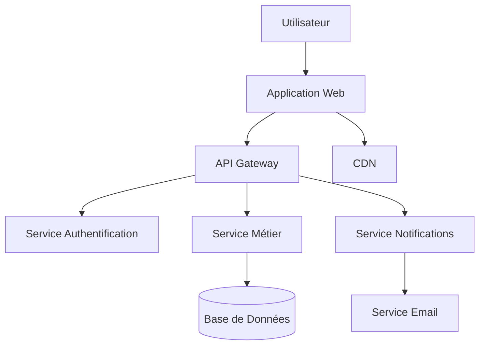
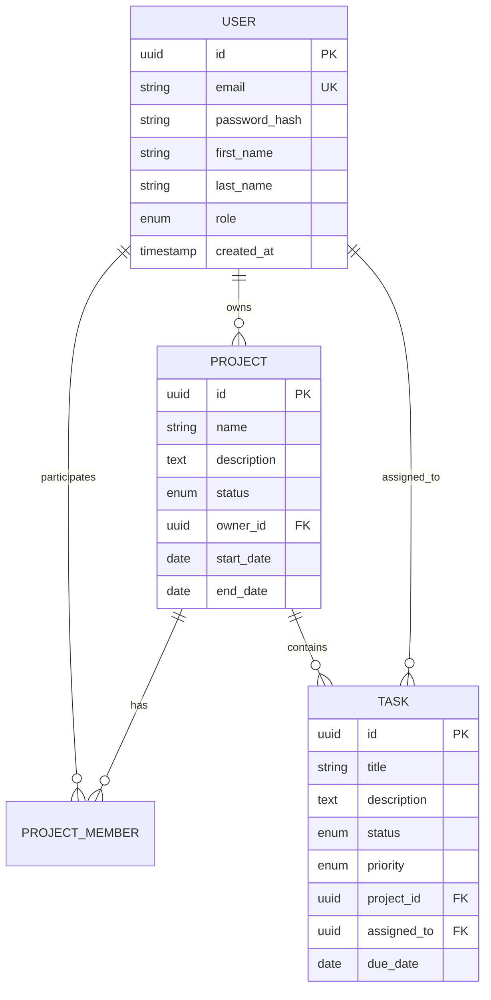

La pré-conception est une phase cruciale qui précède le développement. Elle permet d'analyser en profondeur les besoins, de planifier l'architecture et de prendre les bonnes décisions techniques avant de commencer à coder.

## 🎯 Objectifs de la Pré-conception

### Pourquoi la Pré-conception ?

- **Réduire les risques** : Identifier les problèmes potentiels tôt
- **Optimiser les coûts** : Éviter les refactorisations coûteuses
- **Améliorer la qualité** : Concevoir une architecture solide
- **Accélérer le développement** : Clarifier les objectifs et contraintes
- **Faciliter la communication** : Aligner toute l'équipe

<Note>
**Principe clé** : "Une heure de planification économise dix heures de développement." La pré-conception est un investissement rentable.
</Note>

### Livrables de la Phase

```markdown
# Livrables de Pré-conception

## Documents d'Analyse
- [ ] Analyse des besoins utilisateurs
- [ ] Spécifications fonctionnelles
- [ ] Contraintes techniques et business
- [ ] Analyse de risques

## Documents de Conception
- [ ] Architecture système
- [ ] Modèle de données
- [ ] Interfaces et wireframes
- [ ] Plan de tests

## Documents de Planification
- [ ] Roadmap produit
- [ ] Planning de développement
- [ ] Allocation des ressources
- [ ] Stratégie de déploiement
```

## 📊 Analyse des Besoins

### Techniques de Recueil

#### 1. Interviews Utilisateurs

```markdown
# Guide d'Interview Utilisateur

## Préparation
- [ ] Identifier les personas clés
- [ ] Préparer les questions ouvertes
- [ ] Définir les objectifs de l'interview
- [ ] Prévoir la prise de notes/enregistrement

## Questions Types
### Contexte
- "Pouvez-vous décrire votre journée type ?"
- "Quels outils utilisez-vous actuellement ?"
- "Quelles sont vos principales frustrations ?"

### Besoins
- "Que souhaiteriez-vous accomplir idéalement ?"
- "Qu'est-ce qui vous ferait gagner du temps ?"
- "Qu'est-ce qui est absolument essentiel ?"

### Priorités
- "Si vous ne pouviez avoir qu'une fonctionnalité, laquelle ?"
- "Qu'est-ce qui vous empêcherait d'utiliser l'outil ?"
```

#### 2. Ateliers de Co-conception

```markdown
# Atelier Design Thinking

## Phase 1 : Empathie (30 min)
- Personas mapping
- User journey mapping
- Pain points identification

## Phase 2 : Définition (20 min)
- Problem statement
- How Might We questions
- Success criteria

## Phase 3 : Idéation (40 min)
- Brainstorming de solutions
- Dot voting
- Solution clustering

## Phase 4 : Prototype (60 min)
- Sketching
- Paper prototyping
- Story boarding

## Phase 5 : Test (30 min)
- User feedback
- Iteration planning
```

### Documentation des Besoins

#### Template d'Expression de Besoin

```markdown
# Expression de Besoin - [Nom du Projet]

## 1. Contexte Business
### Problématique
[Description du problème à résoudre]

### Enjeux
- **Financiers** : [Impact budgétaire, ROI attendu]
- **Stratégiques** : [Positionnement concurrentiel]
- **Opérationnels** : [Amélioration des processus]

### Utilisateurs Cibles
| Persona | Profil | Besoins Principaux | Contraintes |
|---------|--------|-------------------|-------------|
| Utilisateur Final | [Description] | [Liste des besoins] | [Limitations] |
| Administrateur | [Description] | [Liste des besoins] | [Limitations] |
| Manager | [Description] | [Liste des besoins] | [Limitations] |

## 2. Exigences Fonctionnelles
### Fonctionnalités Critiques
- [ ] **F1** : [Description détaillée]
  - Critères d'acceptation : [Liste]
  - Priorité : Critique
  - Complexité : [Estimation]

### Fonctionnalités Importantes
- [ ] **F2** : [Description détaillée]

### Fonctionnalités Souhaitables
- [ ] **F3** : [Description détaillée]

## 3. Exigences Non-Fonctionnelles
### Performance
- Temps de réponse : < 2 secondes
- Débit : 1000 utilisateurs simultanés
- Disponibilité : 99.9%

### Sécurité
- Authentification : OAuth 2.0
- Chiffrement : TLS 1.3
- Données personnelles : RGPD compliant

### Compatibilité
- Navigateurs : Chrome, Firefox, Safari, Edge
- Appareils : Desktop, tablette, mobile
- OS : Windows, macOS, Linux
```

## 🏗️ Architecture et Conception

### Modélisation du Système

#### Diagrammes de Contexte



#### Architecture en Couches

```markdown
# Architecture 3-Tiers

## Couche Présentation
- **Frontend** : React.js / Vue.js
- **Mobile** : React Native / Flutter
- **Responsive** : Bootstrap / Tailwind CSS

## Couche Logique Métier
- **API** : Node.js / Python / Java
- **Authentication** : JWT / OAuth 2.0
- **Business Logic** : Services métier
- **Validation** : Règles de gestion

## Couche Données
- **Base Principale** : PostgreSQL / MySQL
- **Cache** : Redis / Memcached
- **Files** : AWS S3 / Azure Blob
- **Search** : Elasticsearch
```

### Modélisation des Données

#### Modèle Conceptuel

```sql
-- Exemple : Application de Gestion de Projets

-- Entités Principales
User {
  id: UUID (PK)
  email: STRING UNIQUE
  password_hash: STRING
  first_name: STRING
  last_name: STRING
  role: ENUM(USER, ADMIN, MANAGER)
  created_at: TIMESTAMP
  updated_at: TIMESTAMP
}

Project {
  id: UUID (PK)
  name: STRING
  description: TEXT
  status: ENUM(DRAFT, ACTIVE, COMPLETED, ARCHIVED)
  owner_id: UUID (FK -> User.id)
  start_date: DATE
  end_date: DATE
  created_at: TIMESTAMP
}

Task {
  id: UUID (PK)
  title: STRING
  description: TEXT
  status: ENUM(TODO, IN_PROGRESS, DONE)
  priority: ENUM(LOW, MEDIUM, HIGH, URGENT)
  project_id: UUID (FK -> Project.id)
  assigned_to: UUID (FK -> User.id)
  due_date: DATE
  created_at: TIMESTAMP
}

-- Relations
ProjectMember {
  project_id: UUID (FK -> Project.id)
  user_id: UUID (FK -> User.id)
  role: ENUM(MEMBER, LEAD, OBSERVER)
  joined_at: TIMESTAMP
}
```

#### Diagramme Entité-Relation



### Conception d'Interface

#### Wireframes et Maquettes

```markdown
# Process de Design UI/UX

## 1. User Journey Mapping
- [ ] Identifier les parcours utilisateur principaux
- [ ] Cartographier les étapes et points de contact
- [ ] Identifier les moments de friction
- [ ] Définir les émotions à chaque étape

## 2. Information Architecture
- [ ] Inventaire du contenu existant
- [ ] Catégorisation et hiérarchisation
- [ ] Navigation et menu structure
- [ ] Taxonomie et étiquetage

## 3. Wireframing
- [ ] Esquisse basse fidélité (papier/balsamiq)
- [ ] Structure des pages principales
- [ ] Placement des éléments clés
- [ ] Navigation entre les écrans

## 4. Prototypage
- [ ] Maquettes haute fidélité (Figma/Sketch)
- [ ] Design system et composants
- [ ] Interactions et animations
- [ ] Tests utilisateurs sur prototype
```

#### Design System

```markdown
# Design System - [Nom du Projet]

## Couleurs
### Couleurs Primaires
- **Primary** : #3B82F6 (Bleu principal)
- **Secondary** : #64748B (Gris secondaire)
- **Success** : #10B981 (Vert succès)
- **Warning** : #F59E0B (Orange avertissement)
- **Error** : #EF4444 (Rouge erreur)

### Couleurs de Fond
- **Background** : #FFFFFF (Blanc)
- **Surface** : #F8FAFC (Gris très clair)
- **Border** : #E2E8F0 (Gris bordure)

## Typographie
### Police Principale
- **Font Family** : Inter, sans-serif
- **Weights** : 400 (Regular), 500 (Medium), 600 (Semi-bold), 700 (Bold)

### Hiérarchie
- **H1** : 2.25rem (36px), Semi-bold
- **H2** : 1.875rem (30px), Semi-bold
- **H3** : 1.5rem (24px), Medium
- **Body** : 1rem (16px), Regular
- **Caption** : 0.875rem (14px), Regular

## Espacement
- **XS** : 0.25rem (4px)
- **S** : 0.5rem (8px)
- **M** : 1rem (16px)
- **L** : 1.5rem (24px)
- **XL** : 2rem (32px)
- **XXL** : 3rem (48px)

## Composants
### Boutons
```css
.btn-primary {
  background: #3B82F6;
  color: white;
  padding: 0.75rem 1.5rem;
  border-radius: 0.5rem;
  font-weight: 500;
}

.btn-secondary {
  background: transparent;
  color: #3B82F6;
  border: 1px solid #3B82F6;
  padding: 0.75rem 1.5rem;
  border-radius: 0.5rem;
}
```
```

## 📋 Analyse de Risques

### Identification des Risques

```markdown
# Matrice des Risques

## Risques Techniques
| Risque | Probabilité | Impact | Criticité | Mitigation |
|--------|-------------|--------|-----------|------------|
| Performance insuffisante | Moyenne | Élevé | **Élevé** | Tests de charge, architecture scalable |
| Sécurité des données | Faible | Très élevé | **Élevé** | Audit sécurité, chiffrement |
| Compatibilité navigateurs | Élevée | Moyen | **Moyen** | Tests cross-browser, polyfills |
| Intégration API tierce | Moyenne | Moyen | **Moyen** | API de fallback, gestion d'erreurs |

## Risques Projets
| Risque | Probabilité | Impact | Criticité | Mitigation |
|--------|-------------|--------|-----------|------------|
| Retard de livraison | Moyenne | Élevé | **Élevé** | Planning buffer, priorisation |
| Changement requis | Élevée | Moyen | **Moyen** | Méthode agile, MVP |
| Ressources indisponibles | Faible | Élevé | **Moyen** | Plan de backup, formation |
| Budget dépassé | Moyenne | Élevé | **Élevé** | Suivi régulier, scope control |
```

### Plan de Contingence

```markdown
# Plan de Contingence

## Si Performance Insuffisante
### Actions Immédiates
- [ ] Audit de performance complet
- [ ] Identification des goulots d'étranglement
- [ ] Optimisation du code critique

### Actions Long Terme
- [ ] Refactoring architecture
- [ ] Mise en place de cache
- [ ] Migration vers infrastructure plus puissante

## Si Retard de Développement
### Actions Immédiates
- [ ] Priorisation des fonctionnalités MVP
- [ ] Augmentation temporaire des ressources
- [ ] Réduction du scope non-critique

### Actions Long Terme
- [ ] Révision des estimations
- [ ] Amélioration des processus
- [ ] Formation de l'équipe
```

## 🎯 Validation et Approbation

### Checklist de Validation

```markdown
# Validation de la Pré-conception

## Documents d'Analyse
- [ ] **Besoins utilisateurs** : Validés par les parties prenantes
- [ ] **Spécifications fonctionnelles** : Complètes et non ambiguës
- [ ] **Contraintes techniques** : Identifiées et documentées
- [ ] **Analyse de risques** : Réalisée avec plans de mitigation

## Conception Technique
- [ ] **Architecture système** : Validée par l'équipe technique
- [ ] **Modèle de données** : Cohérent et normalisé
- [ ] **Interfaces utilisateur** : Validées par les utilisateurs finaux
- [ ] **Stratégie de tests** : Définie et planifiée

## Planification
- [ ] **Roadmap produit** : Approuvée par le management
- [ ] **Planning développement** : Réaliste et détaillé
- [ ] **Budget** : Validé et alloué
- [ ] **Équipe** : Constituée et formée

## Critères de Succès
- [ ] **Métriques** : Définies et mesurables
- [ ] **Acceptance criteria** : Clairs pour chaque fonctionnalité
- [ ] **Definition of Done** : Établie pour l'équipe
```

### Session de Review

```markdown
# Session de Review de Pré-conception

## Participants Requis
- [ ] Product Owner / Chef de Projet
- [ ] Architecte Technique / Lead Developer
- [ ] UX/UI Designer
- [ ] Représentants utilisateurs finaux
- [ ] Stakeholders business

## Agenda Type (2h)
### Introduction (15 min)
- Rappel des objectifs
- Présentation de l'agenda

### Analyse des Besoins (30 min)
- Présentation des personas
- Validation des user stories
- Priorisation finale

### Architecture Technique (45 min)
- Présentation de l'architecture
- Discussion des choix techniques
- Validation des contraintes

### Planning et Risques (30 min)
- Présentation du planning
- Revue des risques identifiés
- Validation des ressources

### Décisions et Actions (20 min)
- Synthèse des décisions
- Plan d'actions
- Prochaines étapes
```

<Note type="success">
**Objectif** : À l'issue de la pré-conception, tous les participants doivent avoir une vision claire et partagée du projet, de ses objectifs, de son architecture et de sa réalisation.
</Note>

## 🚀 Transition vers le Développement

### Préparation de l'Équipe

```markdown
# Onboarding Équipe de Développement

## Documentation à Fournir
- [ ] **Spécifications complètes** : Fonctionnelles et techniques
- [ ] **Maquettes et designs** : Système de design complet
- [ ] **Architecture détaillée** : Diagrammes et documentation technique
- [ ] **Standards de codage** : Guidelines et bonnes pratiques

## Formation Nécessaire
- [ ] **Présentation du projet** : Contexte, objectifs, utilisateurs
- [ ] **Architecture technique** : Technologies, patterns, conventions
- [ ] **Outils et processus** : Git workflow, CI/CD, outils de collaboration
- [ ] **Standards qualité** : Tests, revue de code, documentation

## Environnements à Préparer
- [ ] **Développement** : Configuration locale standardisée
- [ ] **Intégration** : Environnement de tests automatisés
- [ ] **Staging** : Environnement de validation client
- [ ] **Production** : Infrastructure de déploiement
```

### Métriques de Suivi

```markdown
# KPIs de Développement

## Avancement
- **Velocity** : Points story réalisés par sprint
- **Burndown** : Progression vers les objectifs
- **Scope Creep** : Évolution du périmètre

## Qualité
- **Code Coverage** : Pourcentage de code testé
- **Bug Rate** : Nombre de bugs par fonctionnalité
- **Technical Debt** : Dette technique accumulée

## Performance
- **Lead Time** : Temps de réalisation d'une fonctionnalité
- **Cycle Time** : Temps entre début et fin de développement
- **Deployment Frequency** : Fréquence des mises en production
```

---

Une pré-conception réussie est la fondation d'un projet réussi. Elle transforme une idée floue en un plan d'action clair et réalisable !